# Ford ONE Mobile

Aplicativo mobile da solução **Ford ONE**, desenvolvido para o **Desafio 2 da Ford (FIAP 2026)**:
retenção e fidelização de clientes no pós-venda. A Ford ONE mantém o cliente conectado à Rede Ford
combinando **VIN Share**, **inteligência preditiva**, **telemetria IoT** e uma **jornada personalizada**.

> Sprint 3 — Mobile Development and IoT: versão final e publicável em APK, identidade visual
> consolidada, código organizado e demonstração de todas as telas.

**📦 Download do APK:** [Releases → Ford ONE v1.0.0](https://github.com/PeOliveira18/SprintMobile/releases/latest)

---

## Sumário

- [Requisitos da Sprint 3](#requisitos-da-sprint-3)
- [Download do APK](#download-do-apk)
- [Demonstração das telas](#demonstração-das-telas)
- [Funcionalidades e fluxos](#funcionalidades-e-fluxos)
- [Identidade visual (design system)](#identidade-visual-design-system)
- [Arquitetura e organização do código](#arquitetura-e-organização-do-código)
- [Tecnologias](#tecnologias)
- [APIs e dados](#apis-e-dados)
- [Como executar em desenvolvimento](#como-executar-em-desenvolvimento)
- [Como gerar o APK](#como-gerar-o-apk)
- [Como instalar o APK](#como-instalar-o-apk)
- [Qualidade](#qualidade)
- [Integrantes](#integrantes)

---

## Requisitos da Sprint 3

| Requisito | Como foi atendido |
| --- | --- |
| Versão final e publicável em **APK**, com todos os fluxos funcionando sem erros | APK de release gerado e testado em emulador Android 16 (API 36). Todos os fluxos foram revisados: botões sem ação foram ligados a fluxos reais, telas inacessíveis ganharam navegação e os parâmetros de rota passaram a ser sincronizados. |
| **Identidade visual consolidada** (componentes, cores, tipografia e UX) | Design system em [`src/theme`](src/theme/index.ts) com tokens de cor, tipografia, espaçamento, raio e sombra. Todas as cores do app vêm do tema. Componentes compartilhados (`Screen`, `OneCard`, `ActionButton`, `MetricCard`, `StatusBadge`, `TextField`, etc.), ícone, splash e ícone adaptativo da marca, textos com acentuação correta. |
| Produto finalizado: **código organizado**, **README completo** e **demonstração visual de todas as telas** | Camadas separadas (rotas, telas, componentes, hooks, serviços, tipos, constantes e utilitários), sem código duplicado nem sobras de template. ESLint e TypeScript sem erros. Este README traz as capturas de todas as telas. |
| **Build final em APK via Expo EAS Build** (ou equivalente) que instala e executa em dispositivo ou emulador | [`eas.json`](eas.json) com os perfis `preview` e `production` gerando `.apk`. Build local equivalente com `expo prebuild` + Gradle (`npm run build:apk:local`), instalado e validado no emulador. |

---

## Download do APK

O APK final (Android, `br.com.fiap.fordone`, versão 1.0.0) está publicado na página de
[Releases do repositório](https://github.com/PeOliveira18/SprintMobile/releases/latest).

1. Baixe o arquivo `ford-one-v1.0.0.apk` no celular Android (ou no computador, para o emulador).
2. Instale seguindo [Como instalar o APK](#como-instalar-o-apk).
3. Abra o app **Ford ONE** e siga os [fluxos principais](#fluxos-principais).

---

## Demonstração das telas

| Splash | Resumo | Plano do VIN |
| :---: | :---: | :---: |
| 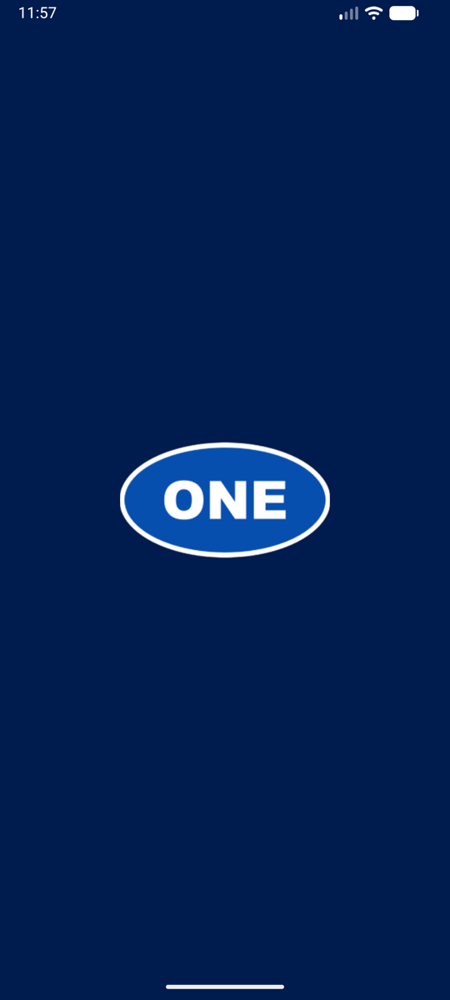 | 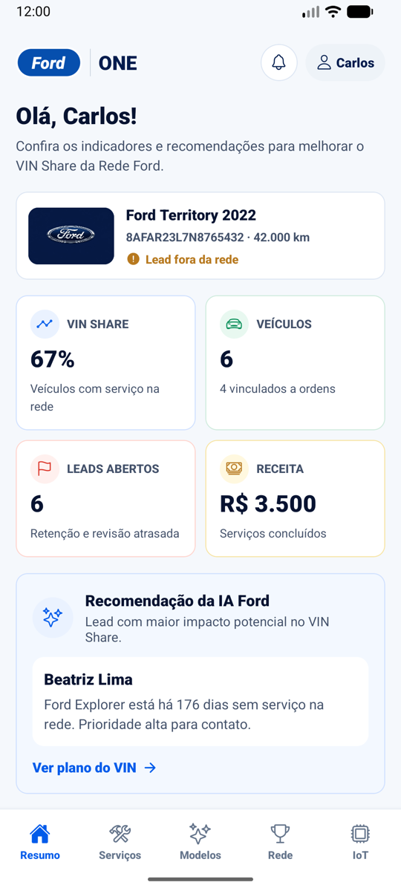 | 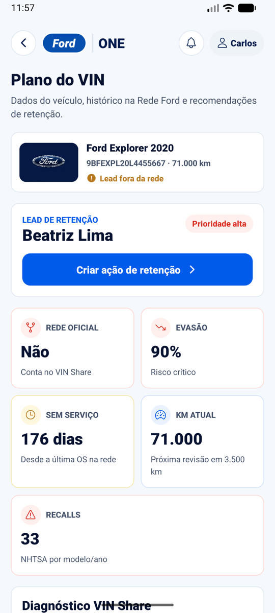 |

| Serviços | Modelos | Rede (concessionárias) |
| :---: | :---: | :---: |
| 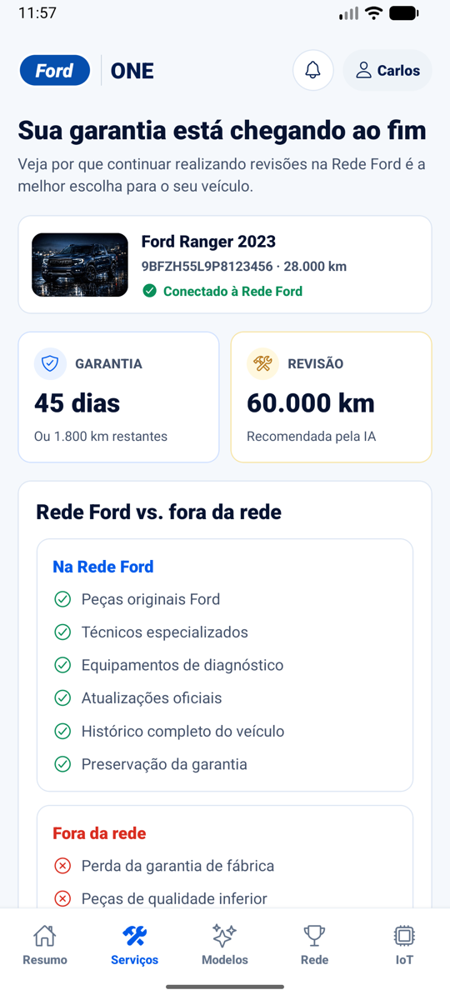 | 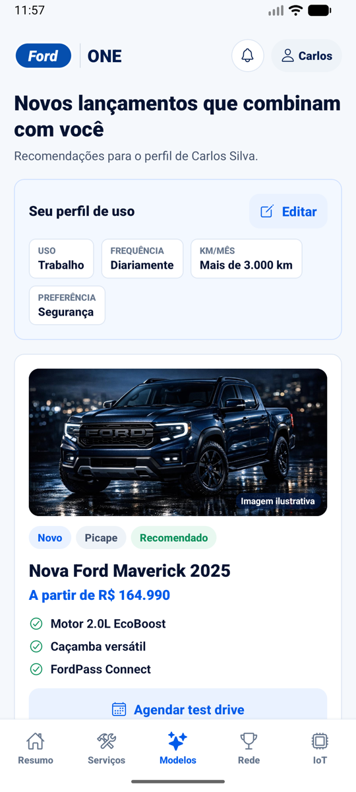 | 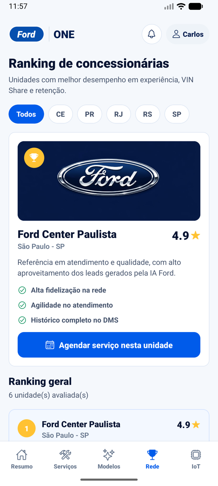 |

| IoT | Leads de retenção | Notificação do lead |
| :---: | :---: | :---: |
| 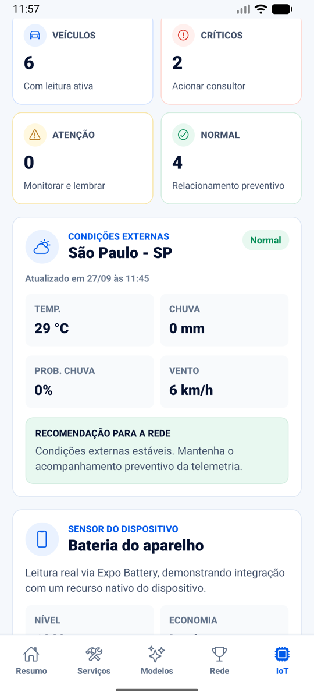 | 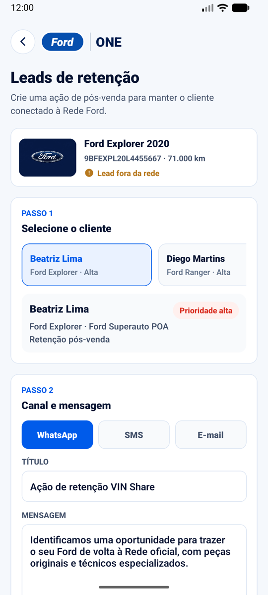 | 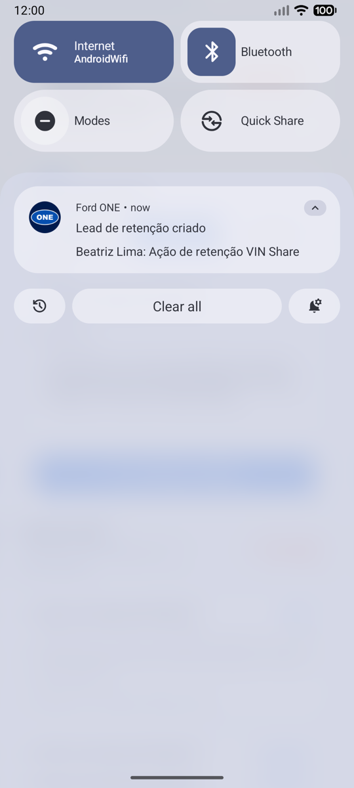 |

| Cadastro (onboarding) | Minha conta | Editar perfil de uso |
| :---: | :---: | :---: |
| 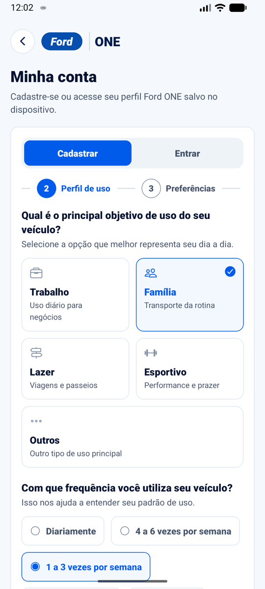 | 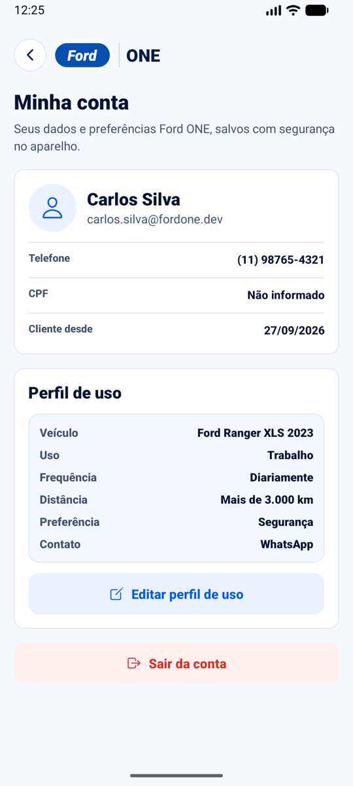 | 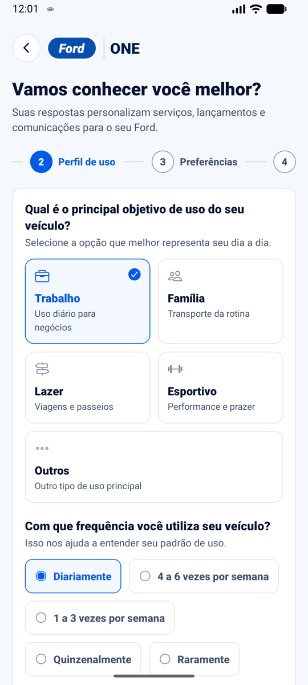 |

---

## Funcionalidades e fluxos

### Telas

| Tela | Rota | O que faz |
| --- | --- | --- |
| **Resumo** | `/` (aba) | VIN Share da rede, veículos, leads abertos, receita, recomendação da IA Ford e lista de leads ordenada pelo risco de evasão. |
| **Plano do VIN** | `/clientes/[id]` | Diagnóstico do cliente: evasão, dias sem serviço, km, recalls reais da NHTSA, dados do veículo e da concessionária e ordens de serviço. |
| **Serviços** | `/servicos` (aba) | Garantia chegando ao fim, comparação Rede Ford x fora da rede e agendamento da revisão recomendada. |
| **Modelos** | `/lancamentos` (aba) | Lançamentos Ford ordenados pelo perfil de uso do cliente, com agendamento de test drive. |
| **Rede** | `/concessionarias` (aba) | Ranking de concessionárias por experiência, VIN Share e receita, com filtro por estado. |
| **IoT** | `/iot` (aba) | Telemetria dos veículos (odômetro, bateria, pneus, óleo), bateria real do aparelho (Expo Battery) e clima real (Open-Meteo) gerando recomendações para a rede. |
| **Leads de retenção** | `/campanha` | Cria ações de pós-venda por cliente e canal, salva no aparelho (AsyncStorage) e dispara notificação local. |
| **Minha conta** | `/conta` | Cadastro com onboarding em 5 etapas, login e sessão local com Expo SecureStore (Keystore/Keychain). |
| **Perfil de uso** | `/perfil` | Edita o perfil de uso da conta; as recomendações do app são atualizadas na hora. |

### Fluxos principais

1. **Retenção de um lead:** Resumo → toque em um lead → Plano do VIN → *Criar ação de retenção* →
   escolha do canal e da mensagem → *Criar lead e notificar* → lead salvo e notificação exibida.
2. **Cadastro e personalização:** ícone de conta no topo → *Cadastrar* → veículo, perfil de uso,
   preferências e contato → *Criar conta* → nome exibido no topo e em *Modelos* com recomendações.
3. **Edição do perfil:** Minha conta → *Editar perfil de uso* → *Salvar perfil* → *Modelos* reordena
   os lançamentos conforme o novo perfil.
4. **Agendamentos:** *Serviços* (revisão), *Modelos* (test drive) e *Rede* (unidade destaque) abrem a
   tela de leads já com o cliente e o título preenchidos.
5. **Monitoramento IoT:** aba IoT → puxar para atualizar → clima real, bateria do aparelho e status
   dos sensores (normal, atenção e crítico).

Todas as telas que buscam dados têm estados de **carregamento**, **erro com "Tentar novamente"**,
**vazio** e **puxar para atualizar**.

---

## Identidade visual (design system)

Os tokens ficam em [`src/theme/index.ts`](src/theme/index.ts) e são a única fonte de cores do app e
a base dos estilos de texto.

| Token | Valor | Uso |
| --- | --- | --- |
| `primary` | `#005BEA` | Ações, links, estados ativos |
| `primaryDark` | `#064FAE` | Oval da marca Ford |
| `navy` | `#001B4D` | Marca, ícone e splash |
| `navyOverlay` | `rgba(0, 27, 77, 0.6)` | Legenda sobre imagens |
| `background` | `#F5F8FC` | Fundo das telas |
| `surface` | `#FFFFFF` | Cards |
| `text` / `textSecondary` / `textMuted` | `#071331` / `#43516A` / `#64748B` | Hierarquia de texto |
| `success` / `warning` / `danger` | `#0A8F5A` / `#B7791F` / `#D92D20` | Status (normal, atenção, crítico) |

**Tipografia:** `display` (24/900) para títulos de tela, `title` (20/900), `section` (19/900),
`cardTitle` (16/900), `body` (14/20), `caption` (12), `overline` (12, caixa alta) e `metric` (24/900).

**Espaçamento e raio:** escala 4 · 8 · 12 · 16 · 24 · 32 e raios 8 · 12 · 16.

**Componentes base** em [`src/components`](src/components):

| Componente | Responsabilidade |
| --- | --- |
| `Screen` | Container padrão (fundo, margens, *pull-to-refresh* e teclado) |
| `FordOneHeader` | Marca Ford ONE, voltar, atalhos de leads e conta, título e subtítulo |
| `OneCard` | Card padrão (`default` e `highlight`) |
| `ActionButton` | Botão `primary`, `secondary` e `danger`, com ícone e modo compacto |
| `MetricCard` / `StatusBadge` | Indicadores e status com tons semânticos |
| `SectionHeader`, `InfoRow`, `TextField`, `EmptyState`, `ErrorMessage`, `Loading` | Padrões de conteúdo e feedback |
| `onboarding/*` | Etapas, perguntas e opções compartilhadas entre cadastro e edição do perfil |

---

## Arquitetura e organização do código

```txt
src/
  app/                    # Rotas (Expo Router)
    _layout.tsx           # Stack raiz, React Query e notificações
    (tabs)/               # Abas: index, servicos, lancamentos, concessionarias, iot
    clientes/[id].tsx     # Plano do VIN
    campanha.tsx          # Leads de retenção
    conta.tsx             # Minha conta
    perfil.tsx            # Perfil de uso
  screens/                # Telas (composição de componentes + hooks)
  components/             # Componentes de UI reutilizáveis
    onboarding/           # Etapas e controles do perfil de uso
  hooks/                  # Hooks de dados (React Query, sessão, bateria, leads)
  services/               # Integrações: NHTSA, Open-Meteo, SecureStore, AsyncStorage, notificações
  constants/              # Opções de onboarding e imagens
  theme/                  # Design tokens
  utils/                  # Formatação (moeda, datas), rótulos e navegação
  types/                  # Tipos de domínio
  mocks/                  # Base simulada de clientes e sensores (CRM/IoT)
```

As rotas só montam as telas. As telas não acessam APIs diretamente: consomem **hooks**, que usam os
**services**. O estado de servidor fica no **TanStack Query** (cache, *retry* e *refetch*), e o
estado local persistente fica no **AsyncStorage** (leads) e no **SecureStore** (conta e sessão).

---

## Tecnologias

- React Native 0.83 + **Expo SDK 55** + TypeScript (strict)
- **Expo Router** (navegação por arquivos, Stack + Tabs)
- **TanStack Query** e **Axios**
- Expo **SecureStore**, **AsyncStorage**, **Notifications**, **Battery**
- **EAS Build** para gerar o APK
- ESLint (`eslint-config-expo`) e `expo-doctor`

---

## APIs e dados

| Fonte | Uso |
| --- | --- |
| [NHTSA Recalls](https://api.nhtsa.gov) — `GET /recalls/recallsByVehicle?make=Ford&model=:model&modelYear=:year` | Recalls reais por modelo e ano, usados no risco de evasão, no diagnóstico e nas ordens de serviço. |
| [Open-Meteo](https://open-meteo.com) — `GET /v1/forecast` (São Paulo) | Clima real para recomendações de pneus, freios, palhetas, bateria e ar-condicionado. |
| Expo Battery | Leitura real do sensor de bateria do aparelho. |
| `src/mocks/retention.ts` | Clientes (CRM/DMS) e leituras de sensores simulados do desafio, enriquecidos com os dados reais acima. |

---

## Como executar em desenvolvimento

Pré-requisitos: Node.js 20+ e o app **Expo Go** no celular (ou um emulador Android).

```bash
npm install
npx expo start --clear
```

Leia o QR Code com o Expo Go ou pressione `a` para abrir no emulador Android.

---

## Como gerar o APK

### Opção 1 — Expo EAS Build (nuvem)

```bash
npm install -g eas-cli
eas login
eas build:configure        # vincula o projeto à sua conta Expo (apenas na primeira vez)
npm run build:apk          # eas build --platform android --profile production
```

Ao final, o EAS mostra um link e um QR Code para baixar o `.apk`. O perfil `preview`
(`npm run build:apk:preview`) também gera APK para distribuição interna.

### Opção 2 — Build local (equivalente, sem conta Expo)

Requer Android SDK e JDK 17.

```bash
npm run build:apk:local
# APK gerado em: android/app/build/outputs/apk/release/app-release.apk
```

O APK local é universal (arm64, armv7, x86 e x86_64) e sai assinado com a chave de debug gerada
pelo `expo prebuild`: instala em qualquer dispositivo ou emulador, mas não serve para a Play Store.
Para publicar na loja, use o EAS Build, que gera e guarda a keystore de produção.

---

## Como instalar o APK

**Emulador:** arraste o `.apk` para a janela do emulador ou use:

```bash
adb install -r app-release.apk
```

**Dispositivo físico:** copie o `.apk` para o celular, abra o arquivo e permita a instalação de
fontes desconhecidas quando o Android pedir.

---

## Qualidade

```bash
npm run typecheck   # TypeScript strict
npm run lint        # ESLint (eslint-config-expo)
npm run doctor      # expo-doctor: dependências e configuração do SDK
```

---

## Integrantes

| Nome | RM |
| --- | --- |
| Pedro Oliveira | 99943 |
| Debora Ivanowski | 555694 |
| Diego Cabral | 557817 |
